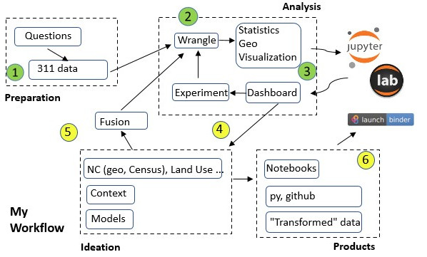

# H4LA Support
This repository is a collection of notebooks, python modules, and data, addressing data literacy issues in the [access the data](https://accessthedata.org/) project at [H4LA](https://github.com/hackforla/access-the-data).  Hopefully it provides some ideas on analytic techniques and provides some guidance to the UX/UI team.  

 
# Introduction - Annotated Workflow  

Let's start with a farily generic data science based workflow and some details for each step:

 

     
 

  

 Initial questons, and data, will support the [311-data](https://github.com/hackforla/311-data) at H4LA.  The 311-data site gets data from the API but I will be using a [snapshot](https://data.lacity.org/City-Infrastructure-Service-Requests/MyLA311-Service-Request-Data-2021/97z7-y5bt) with similar data.  I will use the [personas](https://github.com/hackforla/access-the-data/issues/90) identified in the [311 analysis](https://docs.google.com/document/d/12_RK820ygXpz_yR5ThmW1vbd6GMlopUsk0aIWdV4888/edit) to design the questions.  

 My analysis is straight forward.  I use standard python libraries for dataframes (and geodataframes) to map from file-based inputs to analytics ready data.  I like to get a sense of what's in the data by understanding the semantics of the columns, dtypes, and missing values.  For this 311-data set I need to convert the csv to a geodataframe for display and spatial analytics.  These are all standard idioms for this data type. (Note: What kinds of questions, data fusion, ... does the geo enable?).  Important libraries used in the analysis include `pandas`, `geopandas`, and `numpy`.

 I'm developing/demonstrating with `jupyter lab`.  Lab provides a rich environment for exploration, iteration, visualization...  I make use of multiple widget packages to analyze and visualize the data.  The key packages are `ipywidgets`, `ipyleaflet`, and `bqplot`.  I think good dashboard design is a black art.  I'm going to take some inspiration from the [CfAtl ideas (well maybe GATech)](https://cepl.gatech.edu/dashboardseminars).

 As any analysis unfolds new questions are always uncovered.  This drives us to new and different sources of information for answers.  Part of our research is uncovering information sources to address these new questions.  Part of our understanding comes from applying different analytic techniques such as spatial, time series and crossfiltering.  Our motivation is always about adding more structure to the data we have!  Once I'm beyond the basics I propose to look at the following:  **1)** NC census data to "sort"/"select"/... NC's; **2)** Land use data from LA county to determine relative percentage of residential vs commercial; **and 3)** Street network data to indicate road network complexity.  These are all techniques to use contextual data from the NC's as an order/searching criteria for the 311-calls.

 As I develop analytic notebooks, I like to keep my eye out for opportunities develop packages/modules that can be shared.  I have one simple example in the src directory for reading and transforming the 311 shape file.  As you look at the notebooks you should see examples of repetitive hacks.  These should be converted to code!  Techniques to link, fuse, and share are very important.

 The work flow allows me to package, and document, the processes used in the analysis.  Notebooks (like this one) can be published and shared.  It provides a structured approach to uncovering details in the data, software interfaces for various services, integrating context for understanding, and creating new data sets where they add value. 

## Contents of the Repository

- Data directory contains the various csv and shape files

- Notebooks directory contains the initial notebooks available here:

  ----------------------------
  **311 Data:**
   - [311-data-cleaning.ipynb](notebooks/311-data-cleaning.ipynb) - Process the [311 csv file](https://data.lacity.org/City-Infrastructure-Service-Requests/MyLA311-Service-Request-Data-2021/97z7-y5bt)
   - [311-data-cleaning-part2.ipynb](notebooks/311-data-cleaning-part2.ipynb) - Extend with service region info and leaflet data
   - [build-datasets.ipynb](notebooks/build-datasets.ipynb) - Run this to test and generate data for graffiti and ECWANDC notebooks
   - [api-hacks.ipynb](notebooks/api-hacks.ipynb) - Look at the 311-data.org API
  ------------------------------------ 
  **Add Context:**
   - [NC-service-region.ipynb](notebooks/NC-service-region.ipynb) - Starting point to add some context from [empower.la](https://empowerla.org)
   - [NC-population-density.ipynb](notebooks/NC-population-density.ipynb) - Build a choropleth map with population per square mile

  ------------------------------------
  **Selecting Data:**
   - [311-ncviz.ipynb](notebooks/311-ncviz.ipynb) - Example of selecting an NC and visualizing the data
   - [ECWANDC.ipynb](notebooks/ECWANDC.ipynb) - This example looks at Empowerment Congress West Area
  ------------------------------------
  **Graffiti Analysis:**
   - [311-request-type-analysis.ipynb](notebooks/311-request-type-analysis.ipynb) Experiement with different parameters to select datasets
   - [graffiti.ipynb](notebooks/graffiti.ipynb) - Combine timeline with the map
   - [311-folium-presentation.ipynb](notebooks/311-folium-presentation.ipynb) - Choropleth and animated maps
  ------------------------------------
  **Context Again:**
  - [zoning.ipynb](notebooks/zoning.ipynb) - Lot's-o-work left on this one

This is just the starting point.  There is much more to do!
